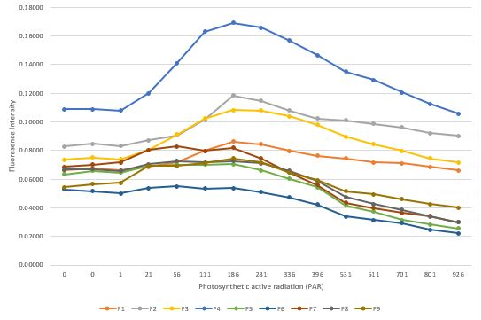

# Home assignment 3, RM-A Field trip

## A new experience
On the 23d of May, as part of the Research Methods course we had a field trip to the intertidal reef zone near kibbutz Sdot Yam and [**Morris Kahn Marine Research station**](https://med-lter.haifa.ac.il/).
### Part 1 - Guided tour
After arriving and receiving initial instructions we made our way to the beach. At first, we simply walked around the reefs, while out TAs and lecturers showed us specific species and interesting characteristics of the reef. At this point we also gathered samples of [*Padina pavonica*](https://www.marinespecies.org/aphia.php?p=taxdetails&id=145385) algae, later used in our analysis.
### Part 2 - Snorkeling for data
Right after we used our snorkeling gear to look for more interesting things around the edges of the reef, as well as install a couple of [HOBO temperature and light level loggers](https://www.onsetcomp.com/) in 2 locations around the reef.
### Part 3 - Chlorophyll and PAM imaging 
After drying out and washing the salt out of our hair, we watched and did an initial evaluation of PAM imaging of our *Padina pavonica* samples. PAM (Pulse Amplitude Modulation) machines provide information on the light reactions of photosynthesis and indirect information about the functioning of the Calvin cycle or ATP status. In our case, we used it to measure chlorophyll fluorescence by exposing our algae samples to bright flashes of light periodically. The resulting fluorescence response was measured, with noticeable declines after especially strong exposure to light signifying overexposure.

**Image 1.** Chosen fields on the *Padina pavonica* samples in a PAM machine interface

### Part 4 - Example results

| #  | Date-Time (Israel Daylight Time) | Ch:1 - Temperature   (°C) | Ch:2 - Light   (lux) |
| -- | -------------------------------- | ------------------------- | -------------------- |
| 81 | 05/23/2024 11:20:00              | 26.25                     | 7421.44              |
| 82 | 05/23/2024 11:21:00              | 26.38                     | 4953.60              |
| 83 | 05/23/2024 11:22:00              | 26.12                     | 0.00                 |
| 84 | 05/23/2024 11:23:00              | 27.24                     | 38338.56             |
| 85 | 05/23/2024 11:24:00              | 26.77                     | 25487.36             |
| 86 | 05/23/2024 11:25:00              | 27.07                     | 47452.16             |

**Fig 1.** Example of HOBO °C and lux data

| Date       | Time       | No. | PAR | F1     | F2     | F3     | F4     | F5     | F6     | F7     | F8     | F9     |
| ---------- | ---------- | --- | --- | ------ | ------ | ------ | ------ | ------ | ------ | ------ | ------ | ------ |
| 23/05/2024 | 1:50:06 PM | 1   | 0   | 0.0662 | 0.0828 | 0.0735 | 0.1088 | 0.0632 | 0.0529 | 0.0686 | 0.0667 | 0.0544 |
| 23/05/2024 | 1:52:22 PM | 2   | 0   | 0.0676 | 0.0848 | 0.075  | 0.1088 | 0.0657 | 0.0515 | 0.0701 | 0.0672 | 0.0564 |
| 23/05/2024 | 1:55:26 PM | 3   | 1   | 0.0662 | 0.0833 | 0.074  | 0.1078 | 0.0647 | 0.05   | 0.0716 | 0.0657 | 0.0574 |
| 23/05/2024 | 1:58:28 PM | 4   | 21  | 0.0686 | 0.0873 | 0.0804 | 0.1201 | 0.0691 | 0.0539 | 0.0804 | 0.0706 | 0.0691 |
| 23/05/2024 | 2:01:31 PM | 5   | 56  | 0.0716 | 0.0907 | 0.0912 | 0.1412 | 0.0701 | 0.0549 | 0.0828 | 0.0725 | 0.0691 |
| 23/05/2024 | 2:04:33 PM | 6   | 111 | 0.0799 | 0.1015 | 0.1025 | 0.1632 | 0.0701 | 0.0534 | 0.0799 | 0.0716 | 0.0711 |
| 23/05/2024 | 2:07:36 PM | 7   | 186 | 0.0863 | 0.1186 | 0.1083 | 0.1691 | 0.0706 | 0.0539 | 0.0819 | 0.0725 | 0.0745 |
| 23/05/2024 | 2:10:38 PM | 8   | 281 | 0.0843 | 0.1147 | 0.1078 | 0.1657 | 0.0662 | 0.051  | 0.0745 | 0.0711 | 0.0716 |
| 23/05/2024 | 2:13:41 PM | 9   | 336 | 0.0799 | 0.1078 | 0.1039 | 0.1569 | 0.0603 | 0.0471 | 0.0647 | 0.0657 | 0.0647 |
| 23/05/2024 | 2:16:43 PM | 10  | 396 | 0.0765 | 0.1025 | 0.098  | 0.1466 | 0.0544 | 0.0422 | 0.0559 | 0.0588 | 0.0593 |
| 23/05/2024 | 2:19:46 PM | 11  | 461 | 0.0515 | 0.0701 | 0.0632 | 0.0941 | 0.0338 | 0.026  | 0.0343 | 0.0353 | 0.0382 |
| 23/05/2024 | 2:22:49 PM | 12  | 531 | 0.0745 | 0.101  | 0.0897 | 0.1353 | 0.0417 | 0.0338 | 0.0436 | 0.0475 | 0.0515 |
| 23/05/2024 | 2:25:51 PM | 13  | 611 | 0.0716 | 0.0985 | 0.0843 | 0.1294 | 0.0373 | 0.0314 | 0.0397 | 0.0426 | 0.0495 |
| 23/05/2024 | 2:28:54 PM | 14  | 701 | 0.0711 | 0.0961 | 0.0799 | 0.1206 | 0.0314 | 0.0294 | 0.0363 | 0.0387 | 0.0461 |
| 23/05/2024 | 2:31:56 PM | 15  | 801 | 0.0686 | 0.0922 | 0.0745 | 0.1127 | 0.0284 | 0.0245 | 0.0343 | 0.0338 | 0.0426 |
| 23/05/2024 | 2:34:59 PM | 16  | 926 | 0.0662 | 0.0902 | 0.0716 | 0.1059 | 0.0255 | 0.0221 | 0.0299 | 0.0299 | 0.0402 |

**Fig 2.** Example of our PAM imaging data. "Par" - strength of light-flash. F1-F9 - specific spots chosen on an algae sample, their fluorescence response

**Fig 3.** Fluorescence intensity chart (**work in progress**)