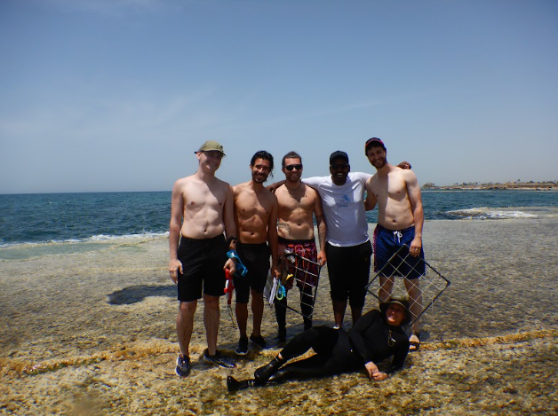

# Home assingment 3, RM-A Field trip 

## A new experience
On the 23d of May, as part of the Research Methods course we had a field trip to the intertidal reef zone near kibbutz Sdot Yam and Morris Kahn marine research station.
### Part 1
After arriving and receiving initial instructions we made our way to the beach. At first, we simply walked around the reefs, while out TAs and lecturers showed us specific species and interesting characteristics of the reef. At this point we also gathered samples of [*Padina pavonica*](https://www.marinespecies.org/aphia.php?p=taxdetails&id=145385) algae, later used in our analysis.
### Part 2
Right after we used our snorkeling gear to look for more interesting things around the edges of the reef, as well as install a couple of [HOBO temperature and light level loggers](https://www.onsetcomp.com/) in 2 locations around the reef.
### Part 3 
After drying out and washing the salt out of our hair, we watched 
