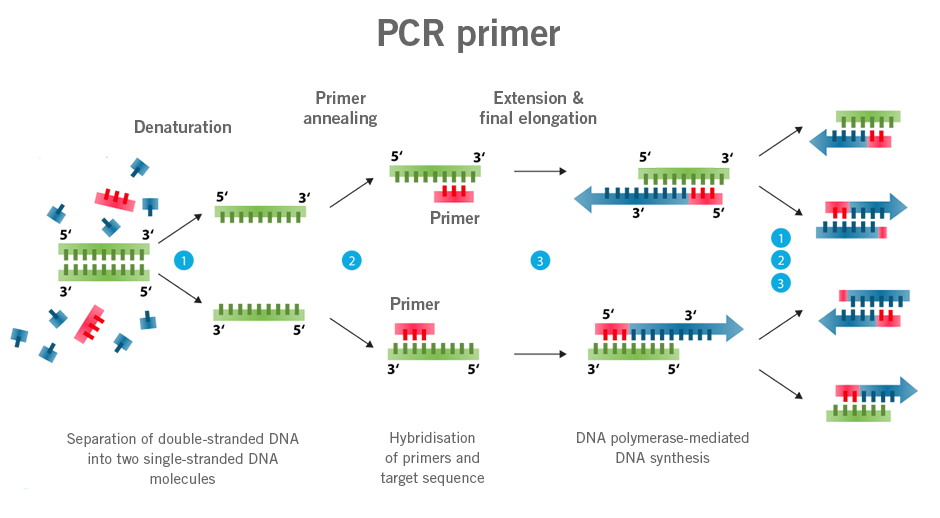
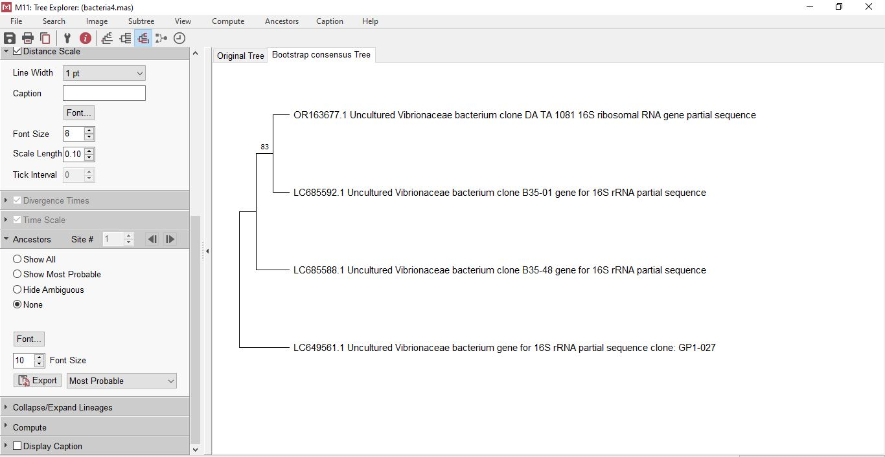

# Primer Design

## Step 1
Because my work isn't based on a single species, but instead looks for a variety of bacterial pathogens and parasites in polled DNA from fish species, Ill attempt to design a primer for one of the most commonly encountered fish pathogens - [*Vibrionaceae*](https://en.wikipedia.org/wiki/Vibrionaceae).

First, I found 4 16S gene sequences of different strains (species not identified) for the bacteria, and used Multiple Sequence Alignment by [CLUSTALW](https://www.genome.jp/tools-bin/clustalw). Getting a conservative region approximately 200-300 bp in length. 
## Step 2
Then, we need to create primers, for this I will paste the most conservative region in the [Primer3 tool](https://primer3.ut.ee/)

|              | start | len | tm    | gc% | any_th | 3'th | hairpin | seq                  |
| ------------ | ----- | --- | ----- | --- | ------ | ---- | ------- | -------------------- |
| Left Primer  | 68    | 20  | 59.01 | 55  | 0      | 1.02 | 0       | GTCGTAAAGCTCTGTCGCAG |
| Right Primer | 286   | 20  | 59.2  | 55  | 0      | 0    | 0       | TCTCCGACACTCAAGCTACG |

**Fig.1** - results of using the primer tool.

## Step 3 
After, we worked on creating a phylogenetic tree in [MEGA](https://www.megasoftware.net/home). A bootstrap consensus version tree was constructed. 

**Fig.2** - bootstrap consensus tree of the 4 chosen *Vibrionaceae* strains. 