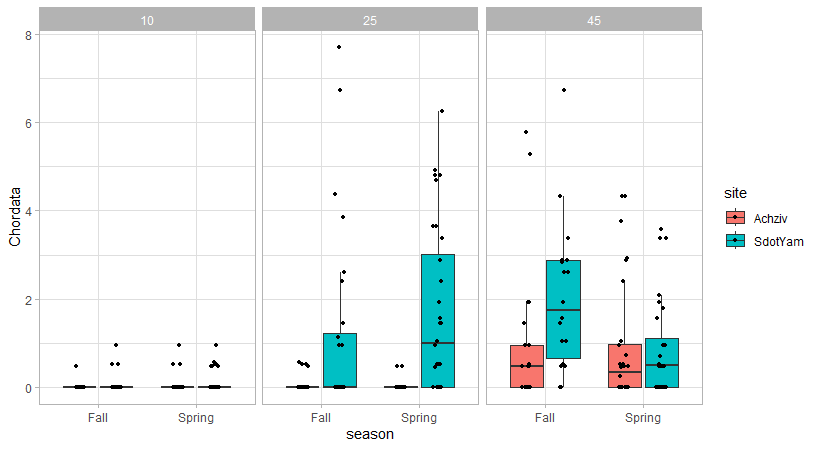
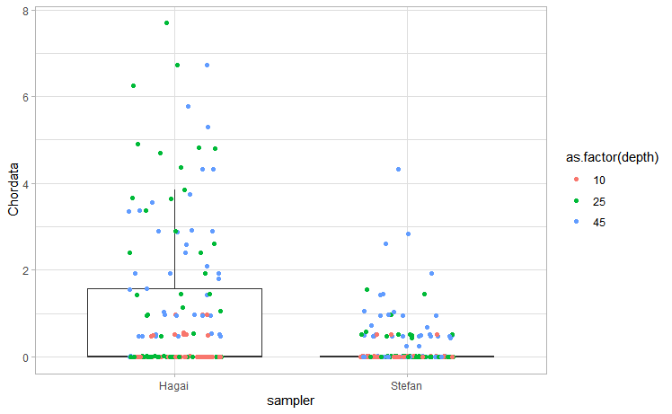
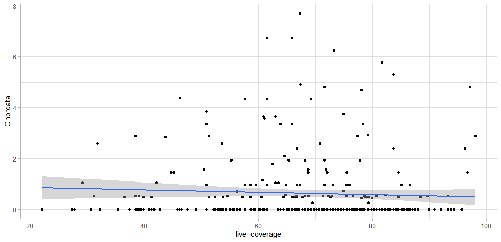

# R homework. Data analysis.
By using the photosyrvey data, we have earned how to analyze parts of that data in R, and present it in the form of various graphs. As homework, we will repeat those steps, but instead of analyzing live_coverage values, Im choosing a specific taxonomic group, Chordata. 
## Step 1 - lets look at Chordata in relation to site

It seems like from these results, that most Chordata individuals in the Achziv site were found at a 45 m. depth. While the Sdot Yam site is represented mostly by both 45 and 25 m. depths. Another explanation could be the amount of samples available at both sites, less in Achziv and more in Sdot Yam. 

## Step 2 - test homogeneity of variance & difference in coverage levels 
**Homogeneity of variance** 
Bartlett's K-squared = 48.859, df = 1, p-value = 2.75e-12

Since the p-value is far less than any commonly used significance level, this means there is strong evidence to suggest that the variances between the groups are not equal. The variances are heterogeneous.

**Difference in coverage levels**
Kruskal-Wallis chi-squared = 24.62, df = 1, p-value = 6.981e-07

Since the p-value is far less than any commonly used significance level, this means there is strong evidence to suggest that the medians between the groups are not equal - coverage levels are different.

## Step 3 - lets look at Chordata in relation to site and *season*

If we do not take the factor of data availability into account, this data may demonstrate the Chordata is more prevalent during spring at 25 m. depth, and more prevalent during fall at 45 m. depth

## Step 4 - lets examine the sampler 

Interestingly, we can see that one sampler (Hagai), is clearly more successful in collecting Chordata data when compared to his colleague (Stefan)

**Homogeneity of variance** 
Bartlett's K-squared = 196.94, df = 1, p-value < 2.2e-16

Since the p-value is far less than any commonly used significance level, this means there is strong evidence to suggest that the variances between the groups are not equal. The variances are heterogeneous.

**Difference in coverage levels**
Kruskal-Wallis chi-squared = 30.241, df = 1, p-value = 3.816e-08

Since the p-value is far less than any commonly used significance level, this means there is strong evidence to suggest that the medians between the groups are not equal - coverage levels are different.

## Step 4 - lets look at the correlation between live coverage and the Chordata taxonomic group

Judging by our data, the correlation isnt strong, so we cannot assume a strong relationship between live coverage and Chordata.